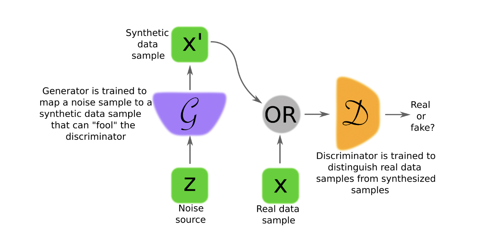
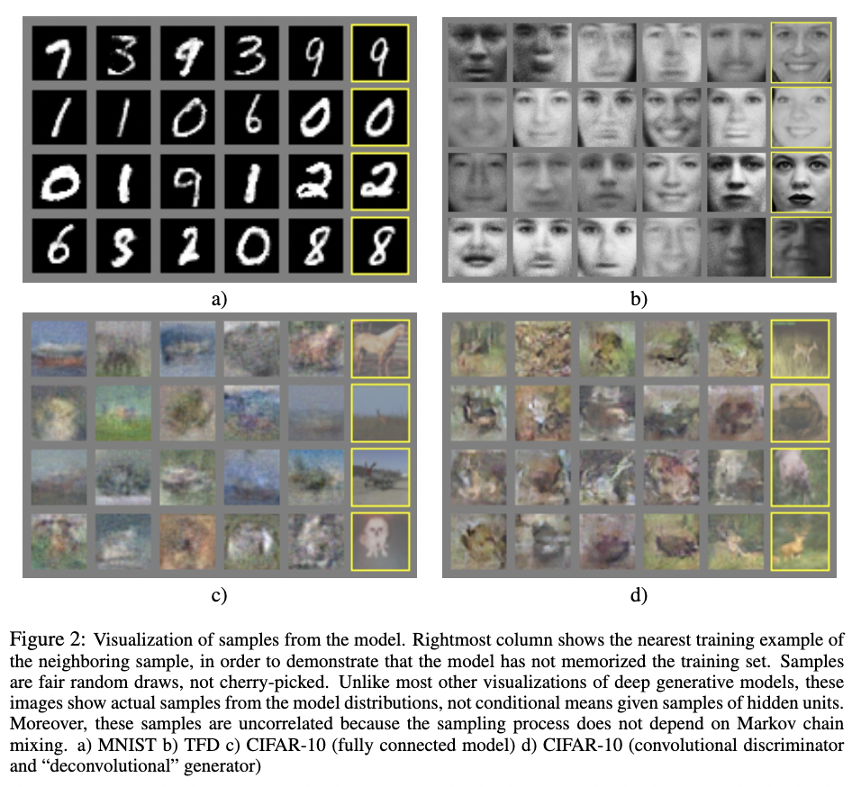
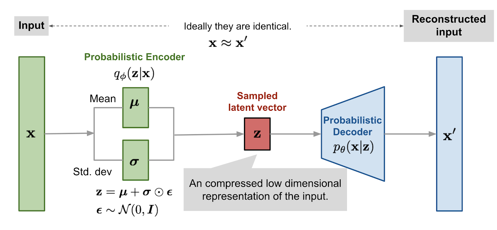
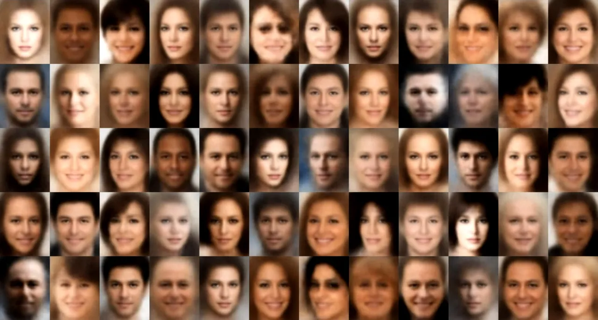
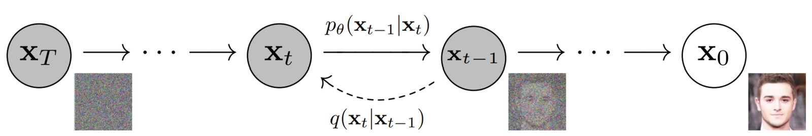
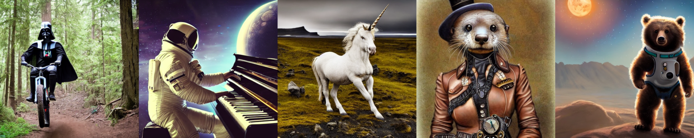
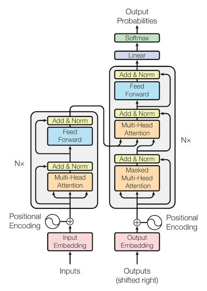

# DALLE-2 

This page will discuss the fundamentals and building blocks that are described in the DALLE-2 paper and model release. 

## Motivation and Background

We start by motivating the problem that DALLE-2 solves for: Image Generation. In A.I., we've seen various models that fall under the image generation objective:

- Generative Adversarial Networks (GANS)
- Autoencoders (AE) and Variational Autoencoders (VAEs)
- Denoising Diffusion Probabilistic Models (DDPMs)

But why would image generation be a useful task? Many might say that it is a well suited problem for ML models because the objective can be approached a well structured supervised learning experiments. In addition, this domain suits blending understandings of Natural Language and Computer Vision to understand how the two are understood by current ML models. From a commercial perspective, we see that there is a large demand for new content especially in the graphic design and digital art space and ML models make it seamless and extremely easy to quickly prototype or brainstorm designs for a variety of tasks whether it be logo generation, marketing content creation and the like. 

Now that we have some background of why this domain is of interest to ML researchers, we will provide some background on the methods that proved successful prior to the approach suggested for DALLE-2. 

### Generative Adversarial Networks

This section describes what is known as a Generative Adversarial Network or GAN. GANs are generally thought of as one of the first generative neural network models that were successfully applied to the image generation domain. The model was first introduced by Ian Goodfellow and his group in the paper [Generative Adversarial Networks [1]](https://arxiv.org/pdf/1406.2661.pdf). 

|  | 
|:--:| 
| *Generative Adversarial Network Diagram* taken from [[2]](https://arxiv.org/pdf/1710.07035.pdf) |

In this diagram, we see the general structure of the GAN based generative model. 

First we see the generator network `G` which is usually some sort of neural network structure that takes random noise `z` and generates an image `x'`. This is used as a training sample for the Discriminator network, also a similar neural network to the generator, but made with the objective of classifying any sample either from a real dataset `x` or from the generator `x'` to determine if the sample is fake or real. 

We can describe this structure a little bit more formally now:

- The Generator $$ G(z, \theta_g)$$ takes sample noise $$z$$ and uses the neural network (most likely Multilayer Perceptron (MLP)) parametrized by $$\theta_g$$ to generate the image sample $$x'$$

- The discriminator $$D(x, \theta_d)$$ takes any real sample image $$x$$ or generated sample image $$x'$$ and, classifies the image into 2 classes: real or fake. 

- The objective that the model is optimizing for can be described using the minimax objective:

$$ min_g max_d \: E_{x \sim p_{data}(x)}[log(D(x))] + E_{z \sim p_{G}(x)}[log(1-D(G(z)))]$$

We can see that this model is trying to maximize the loss of the Discriminator while the Generator tries to minimize the total loss. Lets take a look at the inital results that the paper presented for generative models. 

|  | 
|:--:| 
| *Generative Adversarial Network Outputs* taken from [[1]](https://arxiv.org/pdf/1406.2661.pdf) |

As we can see here, the first GANs were trained on widely known datasets and can be seen to produce fairly good output especially for simpler tasks like MNIST. 

We see a few limitations with GANs that did not allow them to become the most widely used generative model in the case of image generation when compared to other models in the domain:

1. Vanishing/Exploding gradient problem can cause the GAN network training to be very unstable. 

2. GANs require a very large dataset to model the data distribution. 

3. Because we are training 2 networks with different objectives, the training can also be very unstable for GANs. In this case, we have an algorithm provided by the original authors of the paper that uses SGD and partial training for updating the network. 

|  | 
|:--:| 
| *Generative Adversarial Network Training Algorithm* taken from [[1]](https://arxiv.org/pdf/1406.2661.pdf) |

By utilizing this algorithm, we can ensure much more stability in the training phase. 

With this model, we see the capabilities of ML models specifically deep neural network architectures to model image distributions and the high performance we get. Next we will talk about another useful class of models for image generations: Autoencoders (AE) with a special focus on the Variational Autoencoders. 

### Autoencoders and Variational Encoders

Autoencoders are another class of deep learning models that function very well at generative tasks. 

|  | 
|:--:| 
| *Autoencoder Model Diagram* taken from [[3]](https://www.compthree.com/blog/autoencoder/) |

The general structure of an autoencoder model includes 2 neural network components: an Encoder and a Decoder. The Encoder architecture takes the original data and computes a lower dimensional representation of the data. The Decoder then takes this lower dimensional representation and computes an output for a variety of tasks, in this case the image that we would like to recreate as an input. 

These models are generally good at completing the generative task, but are much more suited for denoising approaches rather than generating new models as the distribution learned by the model for the latent vector is directly based on the training data. In this case, we will discuss a different architecture of Autoencoders that have been found to work really well for the generation task: Variational Autoencoders.

Variational Autoencoders (VAEs) introduced in the paper [Auto-Encoding Variational Bayes [6] ](https://arxiv.org/pdf/1312.6114.pdf#page=5)are essentially the same as autoencoders but they add another set of learnable parameters to the Encoder network that more directly try to represent the distribution of the latent space vectors that are being used to generate images in the decoder. 

|  | 
|:--:| 
| *Variational Autoencoder Model Diagram* taken from [[4]](https://medium.com/@judyyes10/generate-images-using-variational-autoencoder-vae-4d429d9bdb5) |

Here we see that the output of the Encoder network is passed through an additional 2 layers that represent the mean and variance. 

These additional layers represent the mean vector $$ \mu_z$$ and the standard deviation vector $$\sigma_z$$ of the latent space vector $$z$$. Together these parameters look to model a function $$q_{\phi}(z\mid x)$$ that is trying to fit the actual probability distribution $$p(z \mid x)$$ for getting a latent vector from any data in the distribution. Thus z would be sampled from $$ N(\mu, \sigma) $$ rather than a direct latent vector derived from the input sample.

One of the important tricks that was implemented in the VAE to be able to accurately train the network is the use of a "reparametrization trick" which allows the model to train the mean and standard deviation parameters. As we see with the diagram, $$z$$ is sampled from the Gaussian normal distribution $$N(\mu, \sigma)$$ but at the training phase, there is no way to propagate a gradient through a normal distribution sample as there is no gradient to pass back through these variables. Rather, we take sample a value $$\epsilon$$ from the isotropic gaussian $$N(0,I) $$ and use that random parameter to compute a latent vector $$z$$ that is still a part of the distribution but is computed using the equation we see in the diagram above: 

$$ z = \mu + \sigma \odot \epsilon $$

This way, we have set parameters that can be moved by the optimizer rather than just a sample that is derived from some normal distribution. This trick allows us to set the objective of the VAE to learn the mean and variance layers of the VAE. 

In the original paper, the loss function for the paper is described using the log likelihood function for the decoder and the KL loss for the encoder: 

$$ L(\theta, \phi, x) = E_{z \sim q_{\phi}(z \mid x)}[log \: p_{\theta}(x|z)] - KL(q_{\phi}(z \mid x) \| p_{\theta}(z)) $$

The first term is for the reconstruction loss of the decoder in recovering X from the latent sample, and the second term is to quantify how far the learned distribution $$q$$ is from the true distribution $$p_{\theta}(z)$$ of the latent vector space that is output by the encoder side of the VAE. In practicality, if the decoder loss $$p_{\theta}(x \mid z)$$ models a gaussian, this first term turns into an MSE loss. After some massaging of the equations, we can get a simplified loss function that looks like: 

$$ L(\theta, \phi, x) = - \frac{1}{2} \sum_{i} 1 + log \: \sigma_i - \mu^2_i - \sigma^2_i $$

Below we provide a look at some results of trainng the variational autoencoder model. As we can see, the VAE provides robust output for the objective of generating random human faces.

|  | 
|:--:| 
| *Variational Autoencoder Faces* taken from [[5]](https://towardsdatascience.com/understanding-variational-autoencoders-vaes-f70510919f73) |

 When we look at the results, there are many examples of suitable or even photorealistic faces, but there are some that do not prove to be convincing outputs. In the case of VAEs, we see fairly good performance, but newer models like diffusion models have proven to give even better performance with similar training data requirements. 

### Denoising Diffusion Probabilistic Models

 Denoising Diffusion Probabilistric Models (DDPMs) are a class of deep learning models that are highly performant at the task of generating models. Similar to Autoencoders, they involve taking image and progressively adding gaussian noise to them until they reach a timestep which renders the image as complete gaussian noise. With these progressively noised samples, we train a model to try and predicts the previous timestep image with the noise removed. These two processes define a forward and backwards process for DDPMs. 

 |  | 
|:--:| 
| *Diffusion Model Diagram* taken from [[6]](https://learnopencv.com/image-generation-using-diffusion-models/) |

Here we see the forwards process $$ q(x_t \mid x_{t-1})$$ which takes a pure image $$x_0$$ and produces the pure gaussian noise $$x_T$$ via the following function: 

$$ q(x_{1:T} \mid x_0) := \prod_{t=1}^T q(x_t \mid x_{t-1}) := \prod_{t=1}^T N(x_t, \sqrt{1-\beta_t} x_{t-1}, \beta_t I)$$

In this case, Beta is a fixed variance schedule that provides us a pure Gaussian noised image at timestep $$T$$. 

The diffusion model is then actually learning the function $$p_{\theta}(x_{0:T})$$ in the backwards process which, as described before, learns the ability to go from $$x_t$$ back to $$x_0$$: 

$$ p_{\theta}(x_{0:T}) := \prod_{t=1}^T p(x_{t-1} \mid x_{t}) : \prod_{t=1}^T N(x_{t-1}, \mu_{\theta}( x_t,t), \sigma_{\theta}(x_t, t))$$

Similar to the VAE model, the diffusion model is learning parameters for the mean $$\mu_{\theta}( x_t,t)$$and variance $$ \sigma_{\theta}(x_t, t)$$ of the model when it is training to learn the backwards process. 

This class of models proves to be the best in photorealism as we see some examples below from Stable Diffusion, a widely known diffusion model that generates images from Natural Language prompts: 

|  | 
|:--:| 
| *Diffusion Model Examples* taken from [[7]](https://cdm.link/2022/08/stable-diffusion-the-slick-generative-ai-tool-just-launched-and-went-live-on-github/) |

The photorealism we see in these examples proves that diffusion models are a very strong class of models in generation of image samples. This model is a large basis of the generative part of DALLE-2 that gives the model its great photorealistic outputs. 

### Transformers

One model that should be given a small mention as it has become one of the most powerful and widely used ML machinery in the recent past is the Transformer. This model takes a sequence and computes a next most likely token for any sequence of inputs. Originally designed for the NLP task of sentence completion like the RNN and other NLP models before it, transformers proved to provide good output for a variety of other ML tasks like image classification and other generation tasks like image generation. 

The diagram below shows the structure of the Transformer model, here we see features of the Autoencoder structure with an encoder and a decoder structure within the transformer. 

|  | 
|:--:| 
| *Transformer Model Diagram* taken from [[8]](https://arxiv.org/pdf/1706.03762.pdf) |

This model utilizes a new module known as an Attention head, which computes the relevancy of one token in the data to any other token in the data. For more information on the calculation, and in the interest of saving time reading this article, please refer to Jay Alammar's [The Illustrated Transformer](https://jalammar.github.io/illustrated-transformer/). 
